# DROID Sim Evaluation

This repository contains scripts for evaluating DROID policies (and planners!) in a simple ISAAC Sim environment.

The simulator includes **7 scenes** (1–7), each with multiple variants that place objects in different configurations:

| Scene | Variants |
|-------|----------|
| 1     | 10 (0–9) |
| 2     | 10 (0–9) |
| 3     | 11 (0–8, 10–11)    |
| 4     | 10 (0–9) |
| 5     | 10 (0–9) |
| 6     | 10 (0–9) |
| 7     | 10 (0–9) |

The simulation is tuned to work *zero-shot* with DROID policies trained on the real-world DROID dataset, so no separate simulation data is required.

**Note:** The current simulator works best for policies trained with *joint position* action space (and *not* joint velocity control). We provide examples for evaluating pi0-FAST-DROID policies trained with joint position control below.

## Scenes

### Scene 1

> Example instruction: *"Put the Rubik's cube in the bowl."*

| Exterior | Wrist |
|----------|-------|
| 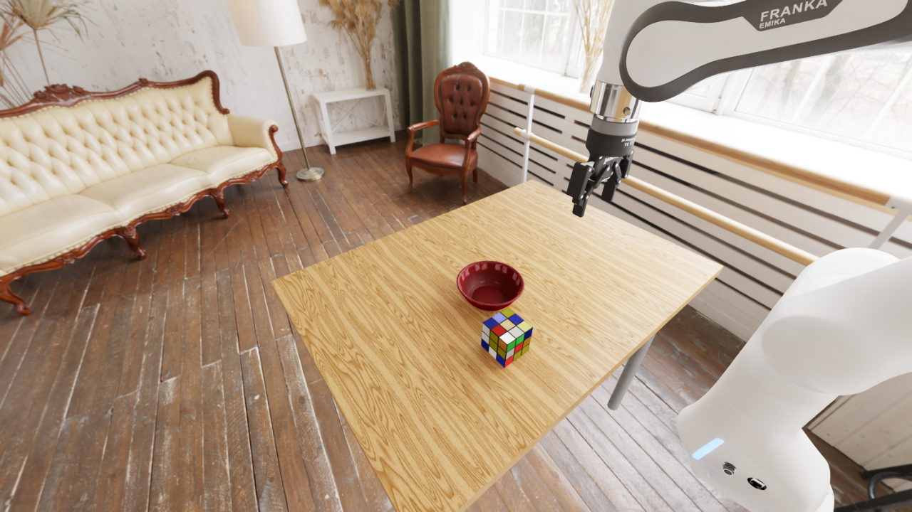 | 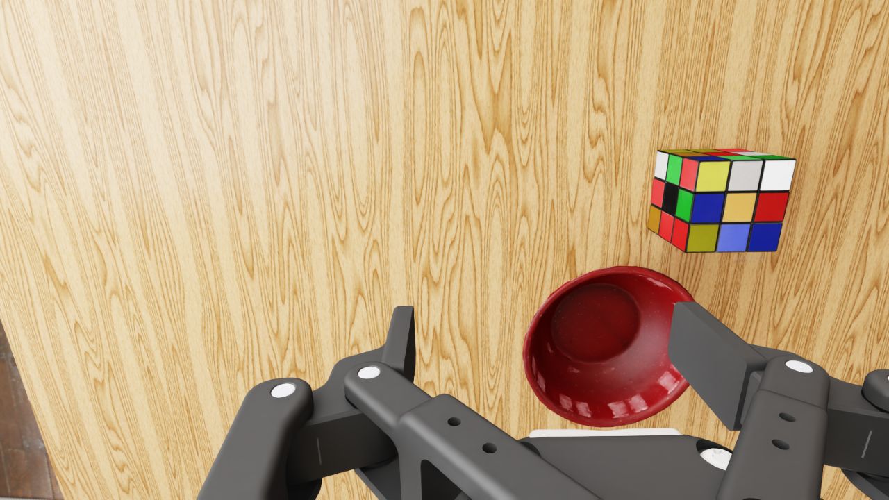 |

---

### Scene 2

> Example instruction: *"Put the can in the mug."*

| Exterior | Wrist |
|----------|-------|
| 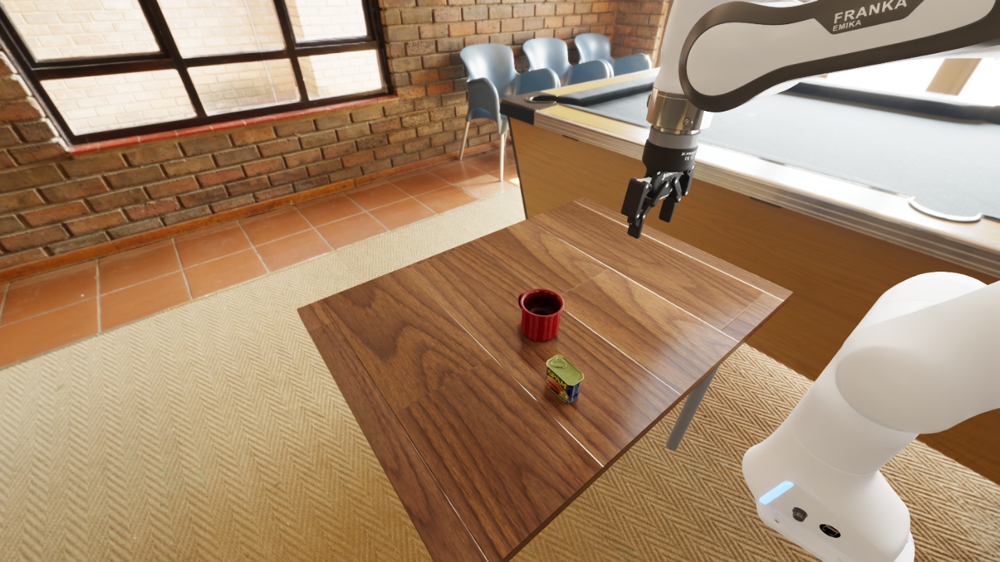 | 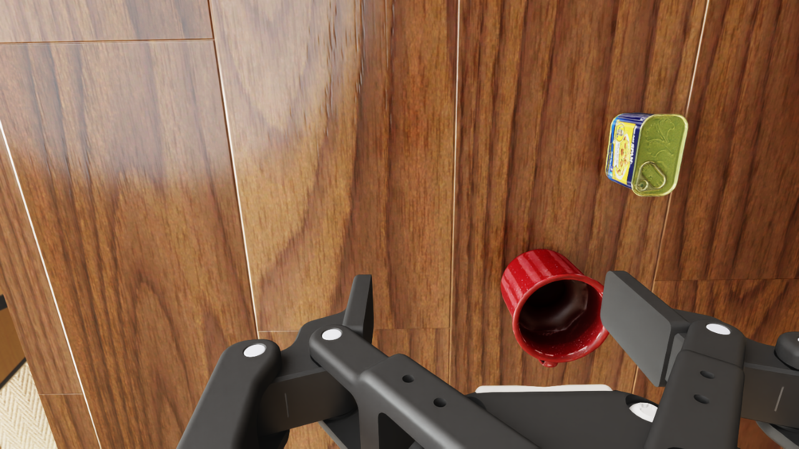 |


---

### Scene 3

> Example instruction: *"Put the banana in the bin."*

| Exterior | Wrist |
|----------|-------|
| 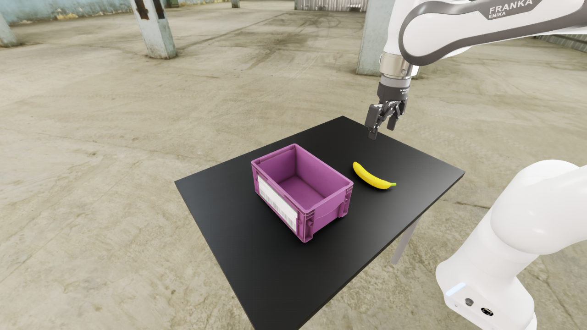 | 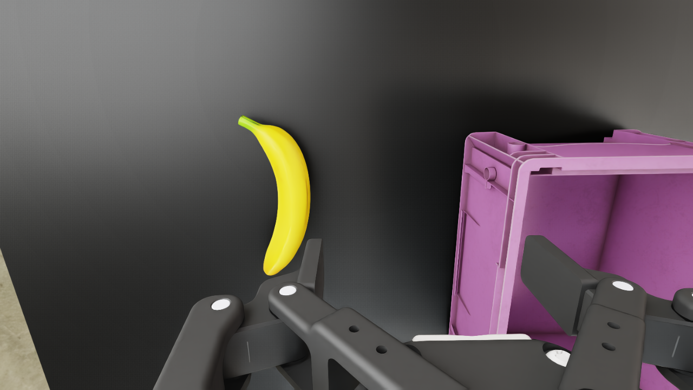 |


---

### Scene 4

> Example instruction: *"Put the cube on the mug and the cans in the bowl."*

A cluttered version of Scene 1 with many distractor objects (soup can, sardine tin, banana, mug, sugar box).

| Exterior | Wrist |
|----------|-------|
| 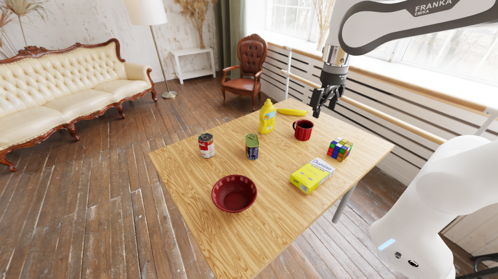 | 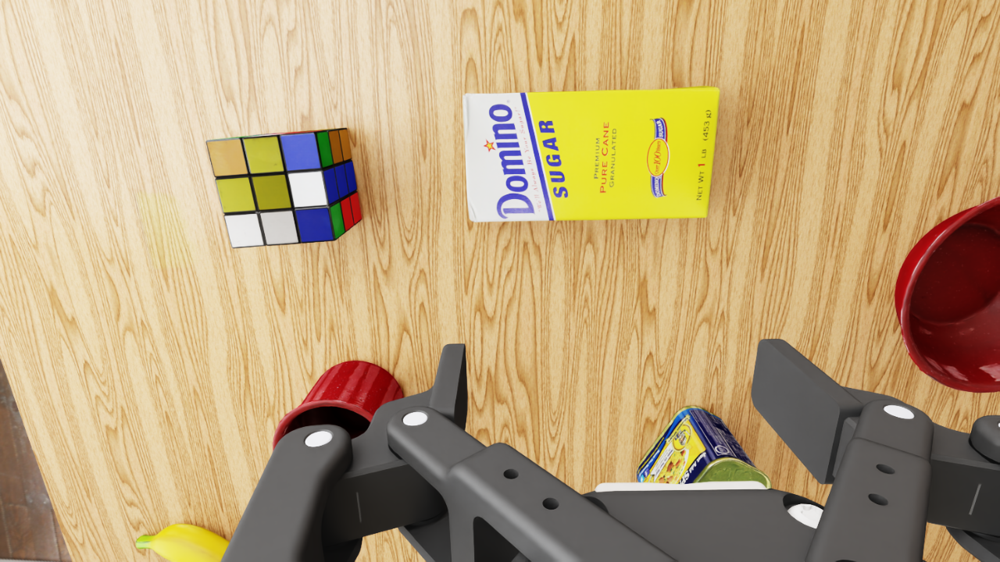 |

---

### Scene 5

> Example instruction: *"Put 3 blocks in the bowl."*

A cluttered version of Scene 2 with multiple colored blocks as distractors.

| Exterior | Wrist |
|----------|-------|
| 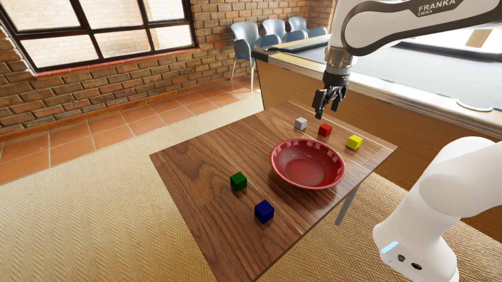 | 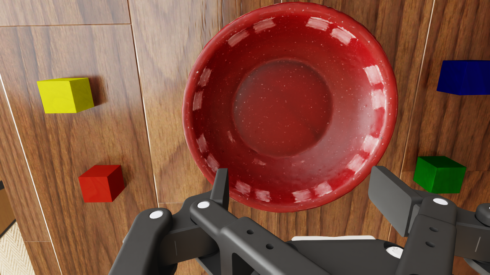 |

---

### Scene 6

> Example instruction: *"Put the Rubik's cube in the bowl."*

Three Rubik's cubes and a bowl. Each variant randomizes the position and rotation of all three cubes.

---

### Scene 7

> Example instruction: *"Pick up a Rubik's cube."*

A cluttered version of Scene 6 with a bowl and distractor objects (tomato soup can, banana, potted meat can, mug, sugar box, mustard bottle). Each variant randomizes positions for all objects.

---

### Scene 8

> Example instruction: *"Put the Rubik's cubes in the bowl."*

A "pre-occupied bowl" variant: one Rubik's cube already sits inside the bowl at the start of the episode, with two more cubes scattered on the open table. The task is non-trivial because the bowl is already partially occupied — the robot has to pack, stack, or first remove the existing cube before the remaining cubes can fit.

| Exterior | Wrist |
|----------|-------|
| 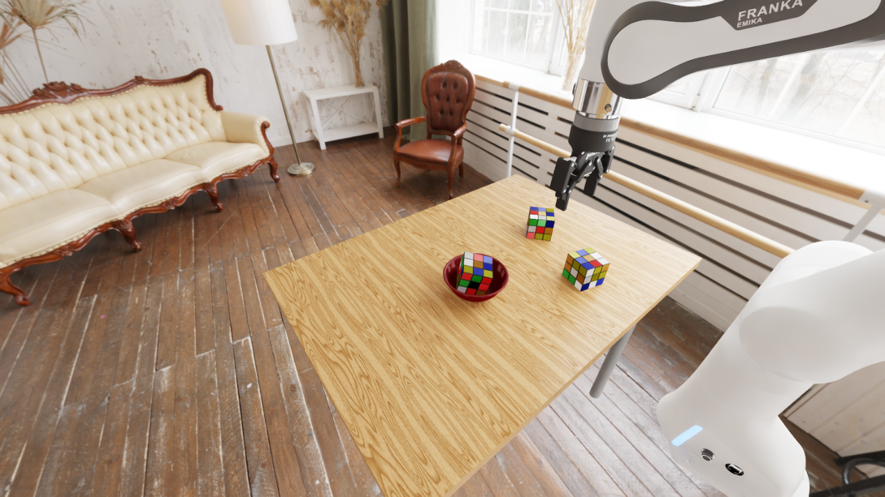 | 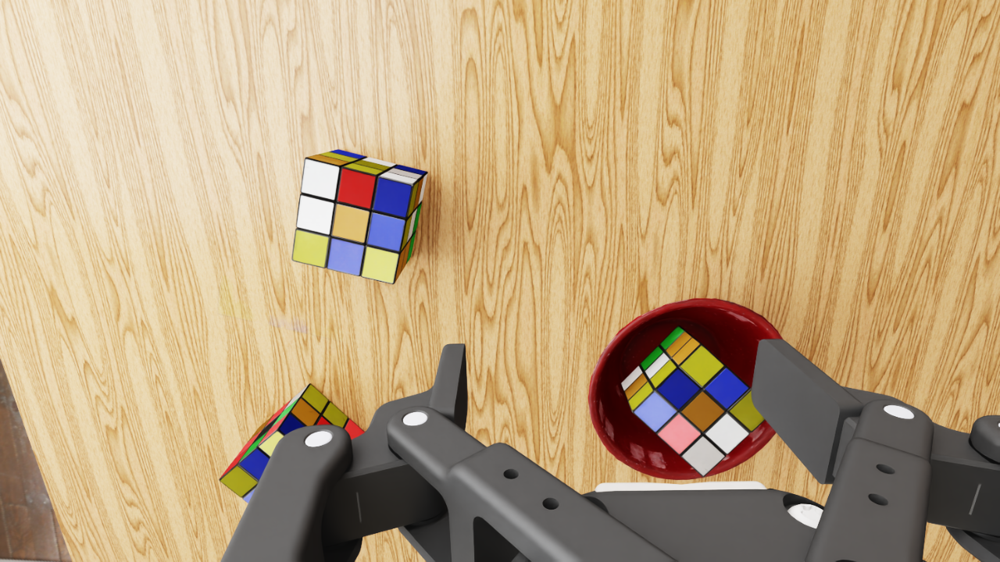 |

> **Asset note**: an earlier attempt at Scene 8 used Scene 5's colored-block assets (blue/red/green/yellow/basic) as the items to place. Those assets turned out to be unusable for repositioning into the bowl: each block has its `PhysicsRigidBodyAPI` on the parent prim (`/World/<color>_block`) while the visual/collision mesh lives on a `Cube` child with a non-zero local `xformOp:translate` — for example `red_block/Cube` has a `(+0.148, -0.002, -0.063)` offset baked in. That means the physics body and the visual mesh are decoupled by up to 15 cm, so there is no single `parent.translate` that puts both the rigid body and the visible cube inside the bowl. Any attempt to normalize the child xform (zeroing its translate) changes how the mesh sits relative to the parent and causes the blocks to settle on the table rather than inside the bowl. Scene 8 therefore uses Scene 1's Rubik's-cube asset instead, which has coincident physics/visual transforms and repositions cleanly.

---

## Generating Scene Assets

Scene USD files are not committed to the repository (the `assets/` directory is gitignored). Download the pre-built assets using the command in the Quick Start section, or generate them locally.

### Downloading pre-built assets

```bash
curl -O https://tiptop-sim-assets.s3.us-east-1.amazonaws.com/assets.zip
unzip assets.zip
```

### Generating Scene 6

Scene 6 is generated locally from `create_scene6.py`, which builds 10 variants (`scene6_0.usd` – `scene6_9.usd`) by copying the scene 1 template and replacing the single cube with three randomized cubes:

```bash
# Requires the venv to be activated and the Isaac Sim USD libs on the path
USD_LIBS=.venv/lib/python3.11/site-packages/isaacsim/extscache/omni.usd.libs-1.0.1+8131b85d.lx64.r.cp311
PY_LIB=$(python3 -c "import sys; print([p for p in sys.path if 'uv/python' in p and 'lib' in p][0])" 2>/dev/null || echo "")
PYTHONPATH=$USD_LIBS LD_LIBRARY_PATH=$USD_LIBS/bin:$PY_LIB python3 create_scene6.py
```

### Generating Scene 7

Scene 7 is generated locally from `create_scene7.py`, which builds 10 variants (`scene7_0.usd` – `scene7_9.usd`) by copying the scene 4 template (which includes distractor objects), removing the bowl and single cube, and adding three randomized cubes:

```bash
USD_LIBS=.venv/lib/python3.11/site-packages/isaacsim/extscache/omni.usd.libs-1.0.1+8131b85d.lx64.r.cp311
PY_LIB=$(python3 -c "import sys; print([p for p in sys.path if 'uv/python' in p and 'lib' in p][0])" 2>/dev/null || echo "")
PYTHONPATH=$USD_LIBS LD_LIBRARY_PATH=$USD_LIBS/bin:$PY_LIB python3 create_scene7.py
```

### Generating Scene 8

Scene 8 is generated locally from `create_scene8.py`, which builds 10 variants (`scene8_0.usd` – `scene8_9.usd`) from the scene 1 template by adding three Rubik's cubes: one dropped into the bowl and two placed at randomized positions on the open table:

```bash
USD_LIBS=.venv/lib/python3.11/site-packages/isaacsim/extscache/omni.usd.libs-1.0.1+8131b85d.lx64.r.cp311
PY_LIB=$(python3 -c "import sys; print([p for p in sys.path if 'uv/python' in p and 'lib' in p][0])" 2>/dev/null || echo "")
PYTHONPATH=$USD_LIBS LD_LIBRARY_PATH=$USD_LIBS/bin:$PY_LIB python3 create_scene8.py
```

Once generated, run scenes like any other:

```bash
python tiptop_eval.py --scene 6 --variant 0 --instruction "Put the Rubik's cube in the bowl."
python tiptop_eval.py --scene 7 --variant 0 --instruction "Pick up a Rubik's cube."
```

### Creating your own scenes

The `create_scene6.py` script shows the general pattern for building a new scene:

1. **Copy a template** — `shutil.copy` an existing scene USD to preserve the table, lights, and robot without flattening payloads.
2. **Remove unwanted prims** — `stage.RemovePrim(path)` to strip objects you don't need.
3. **Copy object prims with `Sdf.CopySpec`** — this copies the full prim spec tree, including the inlined collision child (e.g. `RubikCube` with `PhysxConvexHullCollisionAPI`). Creating prims from scratch misses these collision overrides and causes objects to fall through the table.
4. **Update the transform** — set `xformOp:translate` and `xformOp:rotateZYX` on the copied prim to place it at the desired position.
5. **Save** — `stage.Save()` writes the modified binary USD in place.

---

## Installation

Clone the repo
```bash
git clone --recurse-submodules git@github.com:tiptop-robot/droid-sim-evals.git
cd droid-sim-evals
```

Install uv (see: https://github.com/astral-sh/uv#installation)

For example (Linux/macOS):
```bash
curl -LsSf https://astral.sh/uv/install.sh | sh
```

Create and activate virtual environment
```bash
uv sync
source .venv/bin/activate
```

## Quick Start

First, make sure you download the simulation assets into the root of this directory
```bash
curl -O https://tiptop-sim-assets.s3.us-east-1.amazonaws.com/assets.zip 
unzip assets.zip
```

Then, in a separate terminal, launch the policy server on `localhost:8000`. 

For example, to launch a pi0.5 policy (with joint position control),
checkout [openpi](https://github.com/Physical-Intelligence/openpi) and use the `polaris` configs 
```bash
XLA_PYTHON_CLIENT_MEM_FRACTION=0.5 uv run scripts/serve_policy.py policy:checkpoint --policy.config=pi05_droid_jointpos_polaris --policy.dir=gs://openpi-assets/checkpoints/pi05_droid_jointpos
```

**Note**: We set `XLA_PYTHON_CLIENT_MEM_FRACTION=0.5` to avoid JAX hogging all the GPU memory (since Isaac Sim needs to use the same GPU).

Finally, run the evaluation script:
```bash
python tiptop_eval.py --scene <scene_id> --variant <variant_id> --instruction "<instruction>"
```

## Minimal Example

```python
env_cfg.set_scene(scene, variant)  # pass scene integer and variant integer
env = gym.make("DROID", cfg=env_cfg)

obs, _ = env.reset()
obs, _ = env.reset() # need second render cycle to get correctly loaded materials
client = # Your policy of choice

max_steps = env.env.max_episode_length
for _ in tqdm(range(max_steps), desc=f"Episode"):
    action = client.infer(obs, INSTRUCTION) # calling inference on your policy
    action = torch.tensor(ret["action"])[None]
    obs, _, term, trunc, _ = env.step(action)
    if term or trunc:
        break
env.close()
```
